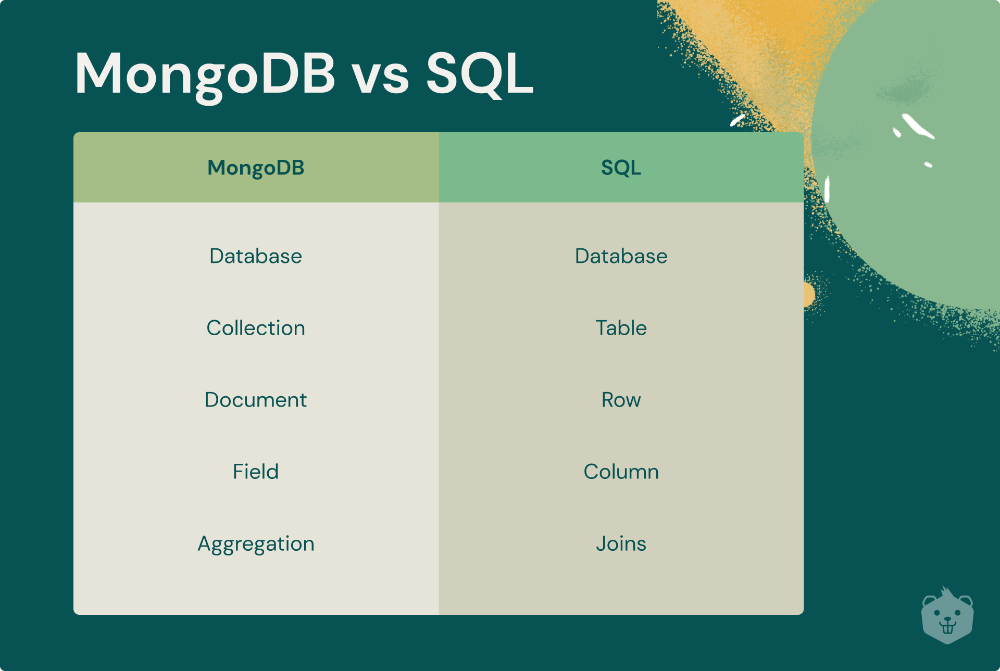

# MongoDB 

Es un sistema de base de datos noSQL, orientado a documentos ( ya no son tablas, sino colecciones ) y de Código abierto, a diferencia de los sistemas de sql, este guarda estructuras de datos JSON con un esquema dinámico, lo cual genera un app mas rápida y fácil de usar. 🖖

## CARACTERÍSTICAS 

1. Basada de documentos: Los datos se almacenan en documentos (JSON).
2. Escalable: Fácil de distribuir datos entre varias maquinas.
3. Flexible: No requiere un esquema de datos del documento, puede tener un numero y tipo de datos diferente.
4. Rendimiento: modelos de datos integrados, indexación, fragmentación, documentos flexibles, duplicación nativa, entre otros.
5. Gratis y código abierto.

## Diferencias noSQL y SQL



## Glosario y Definiciones

1. Par Clave-Valor: Los Documentos contendrán pares clave-valor.

```json
 {"Nombre":"Jose","Apellido":"Cabrejo"}
```
2. Documentos: Son la equivalencia a las filas, es decir los objetos que vamos a guardaren las colleciones.
3. Colecciones: Es un grupo de Documentos y es el equivalesnte a las tablas en las bases de datos sql.
4. Base de datos NoSQL: Las bases de datos no relacionales que agrupan las colecciones.

## Operaciones CRUD

Las operaciones en esta base NosQL consta de crear, leer, actualizar y eliminar documentos.

### Crear operaciones

Son las operaciones de creacion e insercion, donde se anexan documentos a una coleccion, ademas si la coleccion no existe, estas operaciones tambien crean la coleccion.

### Leer Operaciones

Estas recuperan documentos de una coleccion, es decir realiza consultas.

### Actualizar Operaciones

Modifican los documentos existentes de una coleccion, ademas se puede actualizar uno o varios documentos en una sola operacion.

### Eliminar Operaciones

Elimina los documentos existentes de una coleccion, ademas se puede eliminar uno o varios documentos en una sola operacion.

## Funcionamiento

Almacenamiento de documentos: MongoDB almacena datos en bases de datos, que contienen colecciones. Cada colección es un conjunto de documentos que pueden tener diferentes campos y estructuras.
Operaciones 

CRUD: Las operaciones CRUD (Crear, Leer, Actualizar, Eliminar) se utilizan para interactuar con la base de datos. Los datos pueden ser insertados, recuperados, actualizados y eliminados utilizando el lenguaje de consulta de MongoDB.

Indexación: Los índices mejoran el rendimiento de las consultas creando estructuras de datos que permiten a MongoDB localizar y acceder a los datos de manera más eficiente.

Sharding: Cuando los datos crecen más allá de la capacidad de un solo servidor, MongoDB puede distribuir los datos en varias máquinas utilizando el sharding. El sharding se basa en una clave de fragmentación y asegura que los datos relacionados se almacenen juntos.

Replicación: MongoDB puede crear réplicas de los datos en múltiples servidores para garantizar alta disponibilidad y redundancia de los datos. Estas réplicas pueden asumir automáticamente el control si el nodo primario falla.

## Instalación de MongoDB en tu computadora:

1. Ve al sitio web oficial de MongoDB: https://www.mongodb.com/try/download/community
Selecciona el sistema operativo que estás utilizando (por ejemplo, Windows, macOS, o Linux) y descarga la versión de MongoDB Community Server.
Sigue las instrucciones de instalación para tu sistema operativo específico. En la mayoría de los casos, deberás ejecutar un instalador y seguir los pasos proporcionados por el asistente de instalación.

2. Creación de una cuenta en MongoDB Atlas:

Ve al sitio web de MongoDB Atlas: https://www.mongodb.com/cloud/atlas
Haz clic en el botón "Sign Up" (Registrarse) en la esquina superior derecha de la página.
Ingresa tu dirección de correo electrónico y crea una contraseña segura para tu cuenta.
Selecciona la opción "I agree to the MongoDB Terms and Privacy Policy" (Acepto los Términos y la Política de privacidad de MongoDB).
Haz clic en el botón "Get Started Free" (Comenzar gratis) para iniciar el proceso de registro.

3. Configuración de un nuevo clúster en MongoDB Atlas:

Selecciona la opción "Starter Clusters" (Clústeres de inicio) y elige el proveedor de nube (por ejemplo, AWS, Google Cloud, o Azure) y la región donde deseas alojar tu clúster.
Selecciona el tipo de clúster que deseas crear. Para empezar, puedes elegir "Shared" (Compartido) para probar la plataforma sin costos iniciales.
A continuación, elige una opción de nivel de almacenamiento y la versión de MongoDB que deseas utilizar.
Ingresa un nombre para tu clúster. Puedes dejar las opciones predeterminadas para el resto de las configuraciones o personalizarlas según tus necesidades.
Haz clic en el botón "Create Cluster" (Crear clúster) para iniciar el proceso de creación.
Espera unos minutos mientras MongoDB Atlas crea el clúster para ti. Una vez que el clúster esté listo, podrás acceder a él desde el panel de control de MongoDB Atlas y comenzar a trabajar con MongoDB en la nube.

✨ Recuerda que MongoDB Atlas ofrece una capa gratuita con ciertas limitaciones, pero también ofrece opciones de escalado y funcionalidades avanzadas para proyectos más grandes y exigentes. ¡Disfruta usando MongoDB Atlas!✨
